# MVP Pipeline de Dados para Análise de Indicadores Nutricionais

## Evolução da obesidade e do excesso de peso em adultos no Brasil

Este projeto foi desenvolvido com o objetivo de construir um pipeline de dados em nuvem utilizando conceitos de Engenharia de Dados.
Foram utilizados dados sobre obesidade e excesso de peso em adultos, separados por sexo e país. O processamento foi realizado no Databricks com PySpark e organizado seguindo as camadas Bronze, Silver e Gold.
Ao final do pipeline, os dados tratados foram utilizados para analisar a evolução desses indicadores no Brasil entre 1980 e 2024 e realizar uma comparação com outros países da América do Sul.

---
# 1. Contexto de Negócio e Perguntas

## 1.1 Contexto

A obesidade e o excesso de peso são indicadores relacionados ao estado nutricional da população adulta.
A análise histórica desses indicadores permite observar mudanças ao longo do tempo e comparar diferenças entre grupos.
Neste trabalho, foram utilizados dados históricos para analisar como a obesidade e o excesso de peso evoluíram no Brasil, com foco na comparação entre homens e mulheres.
Também foi realizada uma comparação com outros países da América do Sul utilizando o ano mais recente disponível na base.

## 1.2 Objetivo

O objetivo do projeto foi construir um pipeline capaz de receber os dados brutos, aplicar as transformações necessárias, organizar os dados para análise e responder às seguintes perguntas:

1. Como a obesidade evoluiu entre homens e mulheres no Brasil entre 1980 e 2024?
2. Como o excesso de peso evoluiu entre homens e mulheres no mesmo período?
3. A diferença entre homens e mulheres aumentou ou diminuiu ao longo da série histórica?
4. Como a obesidade feminina no Brasil em 2024 se compara à de outros países da América do Sul?

---
## 1.3 Fonte dos dados

Os dados utilizados têm como fonte original a Organização Mundial da Saúde, por meio do Global Health Observatory, e foram obtidos através da plataforma Our World in Data.

Foram utilizados quatro arquivos CSV:
- obesidade em mulheres;
- obesidade em homens;
- excesso de peso em mulheres;
- excesso de peso em homens.

Cada arquivo possui informações de país, código do país, ano e valor do indicador.
Cada conjunto possui 9.270 registros. Considerando as quatro fontes, foram carregados **37.080 registros brutos**.
A série utilizada cobre o período entre **1980 e 2024**.
Os indicadores utilizados são referentes à população adulta com 18 anos ou mais e são padronizados por idade.

## 1.4 Indicadores utilizados

**Obesidade:** percentual estimado de adultos com Índice de Massa Corporal (IMC) igual ou superior a 30 kg/m².
**Excesso de peso:** percentual estimado de adultos com IMC igual ou superior a 25 kg/m².
Os dados possuem valores separados entre homens e mulheres.

---

# 2. Plataforma de Nuvem e Carga dos Dados

## 2.1 Plataforma utilizada

Todo o pipeline foi desenvolvido no **Databricks Free Edition**.

O Databricks foi utilizado para:

- armazenamento dos arquivos de origem;
- criação e execução dos notebooks;
- processamento dos dados com PySpark;
- persistência das tabelas em formato Delta;
- gerenciamento das tabelas através do Unity Catalog;
- execução das consultas analíticas;
- criação das visualizações utilizadas na análise final.

Dessa forma, as etapas de ingestão, transformação, modelagem e análise foram executadas dentro do ambiente de nuvem do Databricks.

### Evidência do armazenamento em nuvem

A imagem abaixo mostra os quatro arquivos armazenados no Volume do Unity Catalog dentro do Databricks.
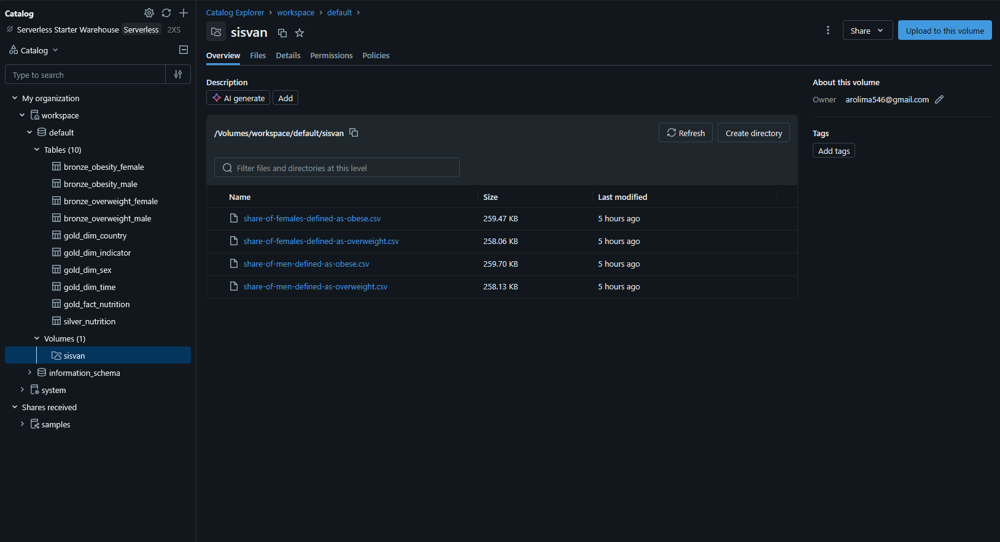

## 2.3 Ingestão dos dados

Os quatro arquivos foram carregados separadamente utilizando PySpark em um notebook do Databricks.
Na camada Bronze, a inferência automática de esquema foi desabilitada para manter inicialmente os campos como texto.
Os arquivos utilizados foram:

```text
share-of-females-defined-as-obese.csv
share-of-females-defined-as-overweight.csv
share-of-men-defined-as-obese.csv
share-of-men-defined-as-overweight.csv
```

Durante a primeira tentativa de persistência das tabelas em formato Delta, foi identificado um problema nos nomes originais das colunas.
A coluna contendo o indicador apresentava caracteres especiais não aceitos diretamente pelo Delta.
Por esse motivo, os campos foram padronizados para:

```text
entity
code
year
raw_value
```
Essa alteração foi realizada apenas nos nomes das colunas.

---

# 3. Modelagem e Catálogo de Dados

## 3.1 Organização das camadas

O pipeline foi dividido nas camadas Bronze, Silver e Gold.

### Bronze

A camada Bronze contém os dados provenientes dos arquivos CSV com o mínimo de alterações necessário para sua persistência.

Foram criadas quatro tabelas:

- `bronze_obesity_female`
- `bronze_obesity_male`
- `bronze_overweight_female`
- `bronze_overweight_male`

Cada tabela corresponde diretamente a uma das quatro fontes utilizadas.

### Silver

Na camada Silver, os quatro conjuntos foram padronizados e reunidos em uma única estrutura.

Foi criada a tabela:

`silver_nutrition`

Nessa etapa foram realizados:

- conversão dos tipos;
- padronização das colunas;
- inclusão do sexo;
- inclusão do indicador;
- união das quatro fontes.

### Gold

Na camada Gold, os dados foram organizados em um modelo dimensional.

Foram criadas as seguintes tabelas:

- `gold_fact_nutrition`
- `gold_dim_country`
- `gold_dim_time`
- `gold_dim_sex`
- `gold_dim_indicator`

---

## 3.2 Modelo dimensional

Foi utilizado um modelo do tipo **Star Schema**.

A tabela `gold_fact_nutrition` concentra a medida de prevalência e se relaciona com quatro dimensões.

```text
                       gold_dim_time
                            |
                            |
gold_dim_country -- gold_fact_nutrition -- gold_dim_sex
                            |
                            |
                    gold_dim_indicator
```

A granularidade da tabela fato corresponde a uma observação para cada combinação de:

`país + ano + sexo + indicador`

A medida armazenada é `prevalence_pct`.

---

## 3.3 Catálogo de Dados

O catálogo abaixo descreve as tabelas utilizadas no pipeline, seus campos, tipos de dados e a origem das informações.

### Tabelas Bronze

As quatro tabelas da camada Bronze possuem a mesma estrutura. A diferença entre elas está no indicador e no sexo representado por cada arquivo de origem.

| Campo | Tipo | Descrição | Origem |
|---|---|---|---|
| `entity` | string | Nome do país ou localidade | Campo `Entity` do arquivo CSV |
| `code` | string | Código do país | Campo `Code` do arquivo CSV |
| `year` | string | Ano da observação | Campo `Year` do arquivo CSV |
| `raw_value` | string | Valor original da prevalência | Coluna de indicador do arquivo CSV |

As tabelas Bronze são:

- `bronze_obesity_female`
- `bronze_obesity_male`
- `bronze_overweight_female`
- `bronze_overweight_male`

---

### Tabela `silver_nutrition`

A tabela Silver reúne os quatro conjuntos da camada Bronze em uma estrutura padronizada.

| Campo | Tipo | Descrição | Domínio / Valores esperados |
|---|---|---|---|
| `country` | string | Nome do país ou localidade | Ex.: Brazil, Argentina, Chile |
| `country_code` | string | Código do país | Ex.: BRA, ARG, CHL |
| `year` | integer | Ano da observação | 1980 a 2024 |
| `sex` | string | Sexo relacionado ao indicador | Female, Male |
| `indicator` | string | Indicador nutricional analisado | Obesity, Overweight |
| `prevalence_pct` | double | Prevalência estimada em percentual | Valores entre 0 e 100 |

A tabela `silver_nutrition` é originada das quatro tabelas Bronze. Os campos `sex` e `indicator` foram adicionados durante a transformação para identificar a origem de cada registro.

---

### Tabela `gold_dim_country`

Dimensão responsável pelas informações de país.

| Campo | Tipo | Descrição |
|---|---|---|
| `country_id` | integer | Chave da dimensão país |
| `country` | string | Nome do país ou localidade |
| `country_code` | string | Código do país |

Origem: campos `country` e `country_code` da tabela `silver_nutrition`.

---

### Tabela `gold_dim_time`

Dimensão responsável pelo período das observações.

| Campo | Tipo | Descrição |
|---|---|---|
| `time_id` | integer | Chave da dimensão tempo |
| `year` | integer | Ano da observação |

Origem: campo `year` da tabela `silver_nutrition`.

---

### Tabela `gold_dim_sex`

Dimensão responsável pelo sexo associado ao indicador.

| Campo | Tipo | Descrição |
|---|---|---|
| `sex_id` | integer | Chave da dimensão sexo |
| `sex` | string | Sexo relacionado ao indicador |

Valores possíveis para `sex`: `Female` e `Male`.
Origem: campo `sex` da tabela `silver_nutrition`.

---

### Tabela `gold_dim_indicator`

Dimensão responsável pelo tipo de indicador nutricional.

| Campo | Tipo | Descrição |
|---|---|---|
| `indicator_id` | integer | Chave da dimensão indicador |
| `indicator` | string | Indicador nutricional analisado |

Valores possíveis para `indicator`: `Obesity` e `Overweight`.
Origem: campo `indicator` da tabela `silver_nutrition`.

---

### Tabela `gold_fact_nutrition`

Tabela fato central do modelo dimensional.
Cada registro representa uma combinação de país, ano, sexo e indicador nutricional.

| Campo | Tipo | Descrição | Relacionamento / Origem |
|---|---|---|---|
| `country_id` | integer | Chave referente ao país | `gold_dim_country.country_id` |
| `time_id` | integer | Chave referente ao ano | `gold_dim_time.time_id` |
| `sex_id` | integer | Chave referente ao sexo | `gold_dim_sex.sex_id` |
| `indicator_id` | integer | Chave referente ao indicador | `gold_dim_indicator.indicator_id` |
| `prevalence_pct` | double | Prevalência estimada em percentual | `silver_nutrition.prevalence_pct` |

A granularidade da tabela fato é:
`país + ano + sexo + indicador`
Essa estrutura permite consultar a prevalência utilizando diferentes dimensões sem repetir os atributos descritivos dentro da tabela fato.
---

# 4. Pipeline de Dados

## 4.1 Camada Bronze

Na primeira etapa foram carregados os quatro arquivos CSV.
Cada conjunto apresentou **9.270 registros**.
Após a leitura, foram realizadas verificações da quantidade de registros, nomes das colunas e esquema.
Os DataFrames foram então persistidos em formato Delta.

**Notebook:** [01_bronze_ingestion.ipynb](notebooks/01_bronze_ingestion.ipynb)

---
## 4.2 Camada Silver

Na camada Silver, os quatro conjuntos foram transformados para possuir a mesma estrutura.
As principais transformações foram:

- padronização dos nomes das colunas;
- conversão de `year` para inteiro;
- conversão de `raw_value` para `double`;
- criação da coluna `sex`;
- criação da coluna `indicator`;
- união das quatro fontes utilizando `unionByName`.

O resultado foi a tabela `silver_nutrition`, contendo **37.080 registros**.

**Notebook:** [02_silver_transformation.ipynb](notebooks/02_silver_transformation.ipynb)

---

## 4.3 Camada Gold

Na camada Gold foram criadas quatro dimensões e uma tabela fato.
Como forma de validação, foi comparada a quantidade de registros antes e depois da modelagem.

```text
Silver: 37.080 registros
Gold Fact: 37.080 registros
```

Não houve perda nem multiplicação de registros durante os relacionamentos.
Também não foram identificadas chaves dimensionais nulas.

**Notebook:** [03_gold_modeling.ipynb](notebooks/03_gold_modeling.ipynb)

## 4.4 Evidência da persistência das tabelas

Após a conclusão das três camadas, foi realizada uma consulta ao catálogo do Databricks utilizando:

```sql
SHOW TABLES IN workspace.default
```

O resultado mostra as quatro tabelas Bronze, a tabela Silver e as cinco tabelas da camada Gold.
Também é possível observar que todas apresentam `isTemporary = false`, indicando que foram persistidas no catálogo e não correspondem apenas a estruturas temporárias da sessão.

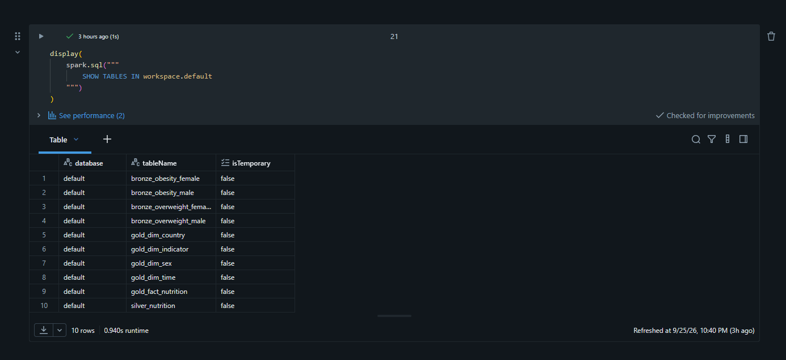

Ao final do pipeline foram persistidas **10 tabelas**:

```text
Bronze
├── bronze_obesity_female
├── bronze_obesity_male
├── bronze_overweight_female
└── bronze_overweight_male

Silver
└── silver_nutrition

Gold
├── gold_dim_country
├── gold_dim_indicator
├── gold_dim_sex
├── gold_dim_time
└── gold_fact_nutrition
```

---
# 5. Qualidade de Dados

A análise de qualidade foi realizada utilizando PySpark diretamente no Databricks.

## 5.1 Completude

Foi verificada a presença de valores nulos em todas as colunas.

**Resultado:** nenhum valor nulo foi encontrado.
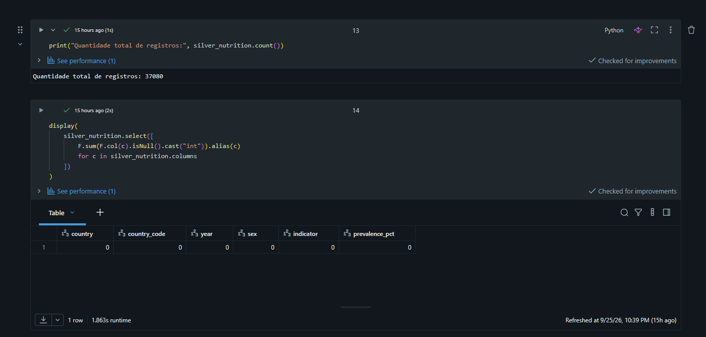

## 5.2 Unicidade

Foi realizada uma busca por registros duplicados considerando:

- `country`
- `country_code`
- `year`
- `sex`
- `indicator`
- `prevalence_pct`

**Resultado:** nenhum registro duplicado foi encontrado.
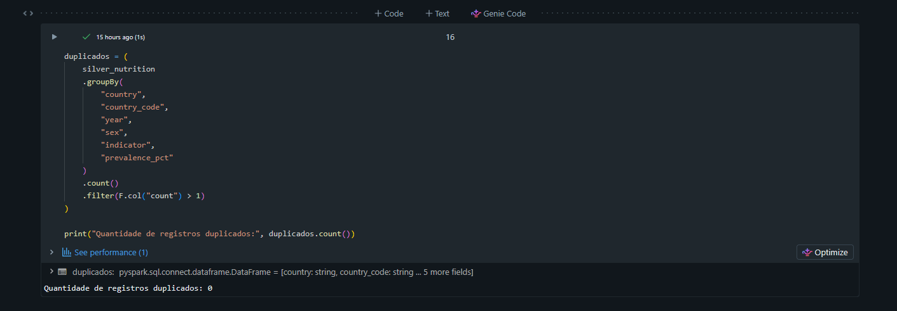
## 5.3 Consistência temporal

Foi verificado o menor e o maior ano presentes na base.

```text
Ano mínimo: 1980
Ano máximo: 2024
```
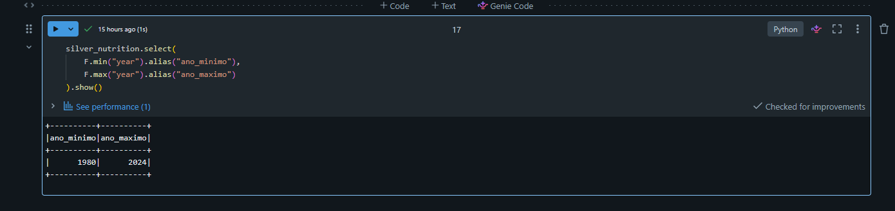

## 5.4 Validade da prevalência
Como `prevalence_pct` representa um percentual, foi verificada a existência de valores menores que 0 ou maiores que 100.
**Resultado:** nenhum valor fora do intervalo foi identificado.

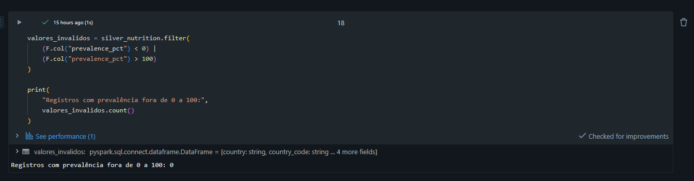
## 5.5 Consistência entre os conjuntos

Também foi analisada a quantidade de registros por sexo e indicador.

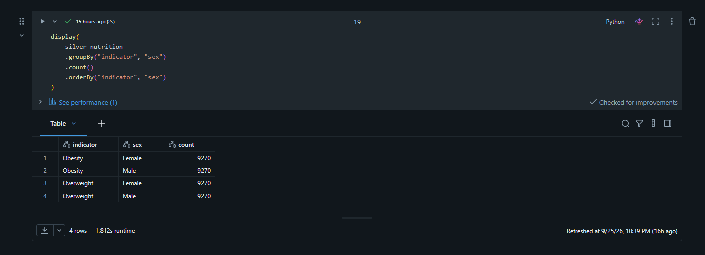

Os quatro grupos apresentaram a mesma quantidade de registros.
Como a fonte já apresentava boa qualidade, não foi necessário excluir duplicidades, preencher valores ausentes ou remover registros inválidos.

---

# 6. Análise de Dados

As análises finais foram realizadas utilizando os dados da camada Gold.
As consultas foram executadas com PySpark e as visualizações foram criadas dentro do próprio Databricks.

## 6.1 Evolução da obesidade no Brasil

Inicialmente foi analisada a evolução da prevalência estimada de obesidade entre homens e mulheres no Brasil.

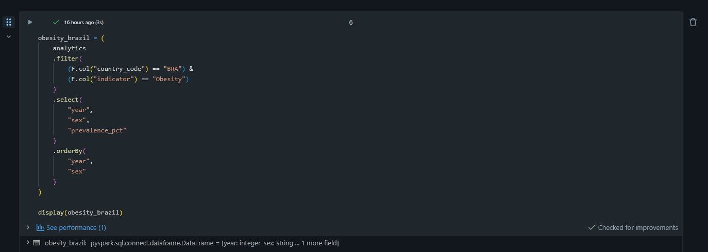
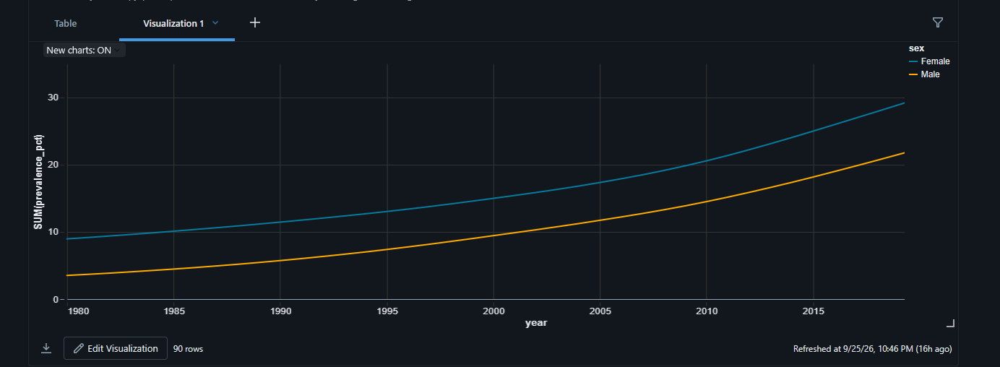

O gráfico mostra crescimento nos dois grupos entre 1980 e 2024.

Entre as mulheres:

- 1980: aproximadamente **8,95%**
- 2024: aproximadamente **33,95%**

Isso representa um aumento de aproximadamente **25 pontos percentuais**.

Entre os homens:

- 1980: aproximadamente **3,50%**
- 2024: aproximadamente **26,05%**
- 

O aumento foi de aproximadamente **22,55 pontos percentuais**.
Durante toda a série analisada, a prevalência feminina permaneceu acima da masculina.

---

## 6.2 Diferença entre homens e mulheres na obesidade

Também foi calculada a diferença entre a prevalência feminina e masculina ao longo do período.

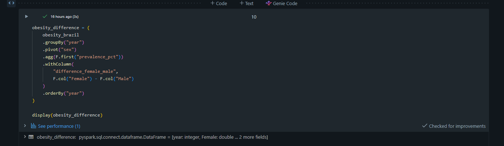
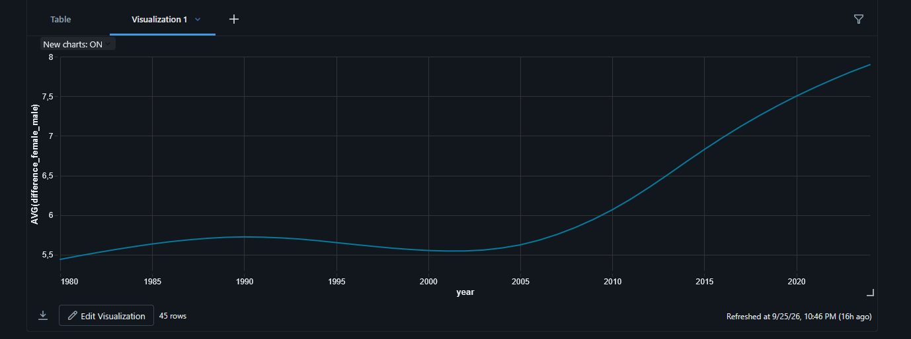

Em 1980, a diferença entre os dois grupos era de aproximadamente **5,44 pontos percentuais**.
Em 2024, a diferença chegou a aproximadamente **7,90 pontos percentuais**.
O gráfico mostra que essa diferença não cresceu de forma constante durante todo o período. Houve pequenas oscilações nas primeiras décadas e um aumento mais forte nos anos seguintes.
No final da série, a diferença entre os sexos era maior do que no início.

---

## 6.3 Evolução do excesso de peso

Em seguida foi analisado o indicador de excesso de peso.

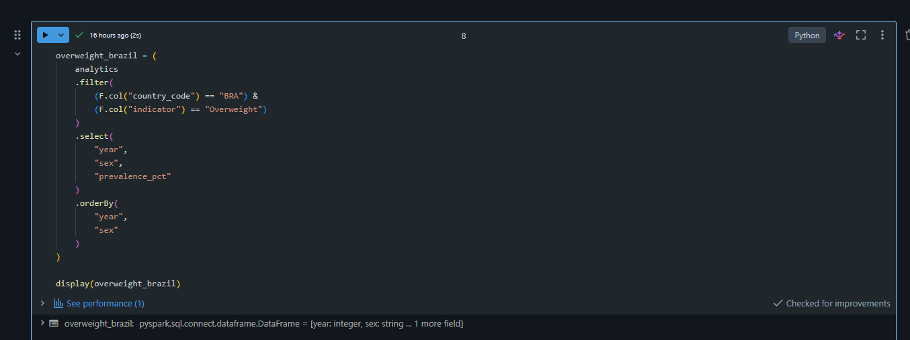
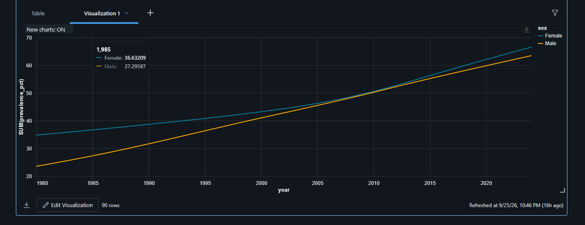


O indicador também apresentou crescimento entre 1980 e 2024.

Entre as mulheres:

- 1980: aproximadamente **34,75%**
- 2024: aproximadamente **66,48%**

O aumento foi de aproximadamente **31,73 pontos percentuais**.

Entre os homens:

- 1980: aproximadamente **23,52%**
- 2024: aproximadamente **63,42%**

O aumento foi de aproximadamente **39,91 pontos percentuais**.
Nesse indicador, o crescimento entre os homens foi maior.
A diferença entre os sexos passou de aproximadamente **11,24 pontos percentuais em 1980** para aproximadamente **3,06 pontos percentuais em 2024**.
Diferentemente do comportamento observado na obesidade, no excesso de peso a diferença entre homens e mulheres diminuiu ao longo da série.

---

## 6.4 Comparação com países da América do Sul

Para colocar o resultado brasileiro em contexto, foi realizada uma comparação da prevalência feminina de obesidade em 2024 com outros países da América do Sul.

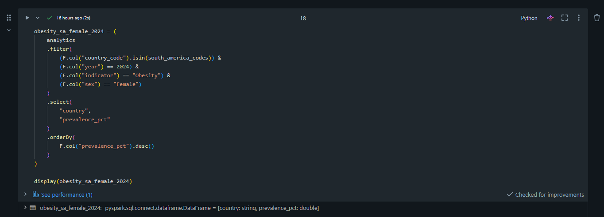
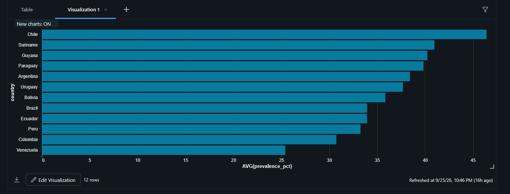
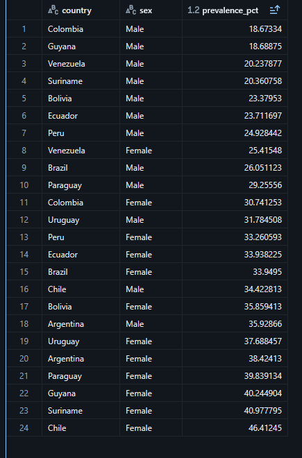

O Brasil apresentou prevalência estimada de aproximadamente **33,95%**.
Entre os 12 países analisados, o Brasil ficou na **oitava posição** quando os valores foram ordenados do maior para o menor.
O maior valor observado foi o do Chile, com aproximadamente **46,41%**.
O menor valor foi o da Venezuela, com aproximadamente **25,42%**.

--- 

## 6.5 Brasil em 2024

Os valores encontrados para o Brasil no último ano disponível foram:

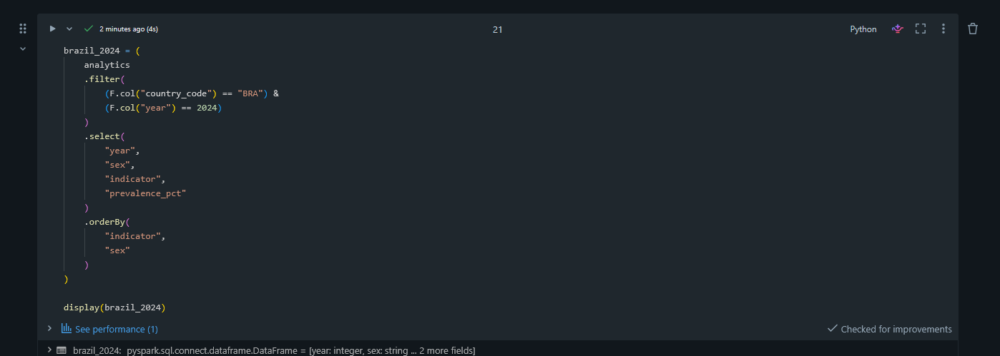
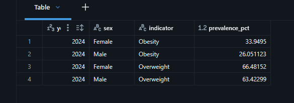

No indicador de excesso de peso, os valores entre homens e mulheres estão mais próximos.
Na obesidade, a diferença entre os dois grupos é maior.

---

## 6.6 Respostas às perguntas do projeto

A partir das análises realizadas, foi possível responder às quatro perguntas definidas no início do projeto.

### 1. Como a obesidade evoluiu entre homens e mulheres no Brasil entre 1980 e 2024?
A prevalência estimada de obesidade aumentou para os dois sexos durante o período analisado.
Entre as mulheres, passou de aproximadamente **8,95% em 1980 para 33,95% em 2024**, um aumento de cerca de **25 pontos percentuais**.
Entre os homens, passou de aproximadamente **3,50% para 26,05%**, representando aumento de aproximadamente **22,55 pontos percentuais**.
Durante toda a série, a prevalência feminina permaneceu acima da masculina.

### 2. Como o excesso de peso evoluiu entre homens e mulheres no mesmo período?

O excesso de peso também apresentou crescimento nos dois grupos.
Entre as mulheres, a prevalência passou de aproximadamente **34,75% em 1980 para 66,48% em 2024**.
Entre os homens, passou de aproximadamente **23,52% para 63,42%**.
O crescimento foi maior entre os homens, com aumento de aproximadamente **39,91 pontos percentuais**, enquanto entre as mulheres o aumento foi de aproximadamente **31,73 pontos percentuais**.

### 3. A diferença entre homens e mulheres aumentou ou diminuiu ao longo da série histórica?

O resultado depende do indicador analisado.
Na obesidade, a diferença entre mulheres e homens aumentou. Ela passou de aproximadamente **5,44 pontos percentuais em 1980 para 7,90 pontos percentuais em 2024**.
No excesso de peso ocorreu o contrário. A diferença caiu de aproximadamente **11,24 pontos percentuais para 3,06 pontos percentuais** no mesmo período.
Portanto, a diferença entre os sexos aumentou para obesidade e diminuiu para excesso de peso.

### 4. Como a obesidade feminina no Brasil em 2024 se compara à de outros países da América do Sul?

Em 2024, a prevalência estimada de obesidade feminina no Brasil foi de aproximadamente **33,95%**.
Entre os 12 países sul-americanos analisados, o Brasil ficou na **oitava posição** quando os valores foram organizados do maior para o menor.
O Chile apresentou o maior valor, com aproximadamente **46,41%**, enquanto a Venezuela apresentou o menor, com aproximadamente **25,42%**.
Dessa forma, o Brasil ficou abaixo de parte dos países analisados, mas apresentou prevalência superior à observada em Equador, Peru, Colômbia e Venezuela.

**Notebook:** [04_analysis.ipynb](notebooks/04_analysis.ipynb)

